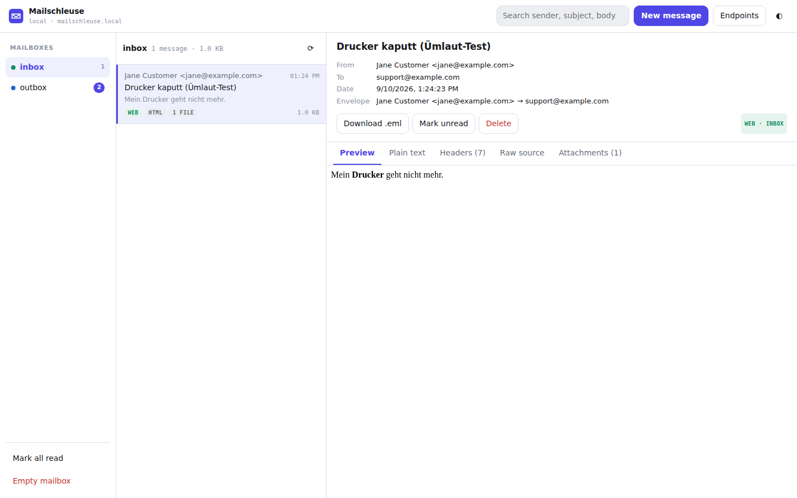

# Mailschleuse

A self-contained mail sink for development and test environments: an **SMTP**
endpoint that captures everything your application sends, a **POP3** endpoint
that serves the mail your application is supposed to receive, and **one web
interface** for both.

One binary, no dependencies, one `docker compose up -d`.



## Why two mailboxes

Most mail sinks give you a single bucket. That breaks as soon as an application
both sends and receives mail: it picks up its own outgoing notifications as new
incoming mail and loops.

Mailschleuse keeps two physically separate queues:

| Mailbox  | Filled by                                   | Read by                          |
| -------- | ------------------------------------------- | -------------------------------- |
| `inbox`  | you, through the web UI or the REST API     | your application, over POP3      |
| `outbox` | your application, over SMTP                 | you, in the web UI               |

Your application can never fetch what it just sent, so a send/receive test stays
a straight line. Both mailboxes live behind the same UI on the same port, and
you can define as many additional mailboxes as you want.

## Quick start

```bash
git clone https://github.com/DieSteinhose/Mailschleuse.git
cd Mailschleuse
docker compose up -d
```

Then open <http://localhost:8080>.

Nothing else is required - every setting has a working default. To change ports
or credentials, copy the template first:

```bash
cp .env.example .env   # then edit and re-run docker compose up -d
```

Without compose:

```bash
docker run -d --name mailschleuse \
  -p 8080:8080 -p 1025:1025 -p 1110:1110 \
  ghcr.io/diesteinhose/mailschleuse:latest
```

## What to put into your application

| Setting                | Value                                             |
| ---------------------- | ------------------------------------------------- |
| **Outgoing (SMTP)**    |                                                   |
| Host                   | `localhost` (or `mailschleuse` on a Docker network) |
| Port                   | `1025`                                            |
| Encryption             | none - or STARTTLS with certificate checks off    |
| Username / password    | anything, unless you set credentials              |
| **Incoming (POP3)**    |                                                   |
| Host                   | `localhost` (or `mailschleuse`)                   |
| Port                   | `1110`                                            |
| Encryption             | none - or STLS with certificate checks off        |
| Username               | `inbox` (any value works by default)              |
| Password               | anything, unless you set credentials              |

The same list, filled in with your actual configuration, is available in the UI
under **Endpoints**.

If your application runs in another container, put both on the same Docker
network and use the service name `mailschleuse` with the *internal* ports 1025
and 1110 - not the ports you published on the host.

## Writing a test mail

**In the UI:** click **New message**, pick the target mailbox, type any sender
address you like, and deliver. The message is stored exactly as if it had
arrived over SMTP, so your application picks it up on the next POP3 poll.

**With curl:**

```bash
curl -X POST http://localhost:8080/api/messages \
  -H 'Content-Type: application/json' \
  -d '{
    "mailbox": "inbox",
    "from": "Jane Customer <jane@example.com>",
    "to": ["support@example.com"],
    "subject": "Printer on floor 2 is offline",
    "text": "The printer stopped working this morning.",
    "html": "<p>The printer stopped working this morning.</p>"
  }'
```

**Replaying a captured `.eml` file:**

```bash
curl -X POST 'http://localhost:8080/api/messages/import?mailbox=inbox' \
  --data-binary @message.eml
```

## Mailbox routing

Where a message ends up is decided in this order:

1. **Routing header** - a message carrying `X-Mailschleuse-Mailbox: inbox` goes
   into that mailbox. Handy for scripts that submit over SMTP but want to
   simulate *incoming* mail. Disable with `MS_SMTP_HEADER_ROUTING=false`.
2. **Recipient route** - `MS_SMTP_ROUTES` redirects mail by its destination
   address, see below.
3. **Login name** - with `MS_SMTP_MAILBOX_FROM_USERNAME=true`, an SMTP client
   authenticating as `inbox` delivers into `inbox`. The same switch exists for
   POP3 (`MS_POP3_MAILBOX_FROM_USERNAME=true`), which lets one endpoint serve
   every mailbox: log in as `outbox` to read what your application sent.
4. **Default** - `MS_SMTP_MAILBOX` for SMTP (`outbox`), `MS_POP3_MAILBOX` for
   POP3 (`inbox`).

More mailboxes are a single variable:

```env
MS_MAILBOXES=inbox,outbox,newsletter,billing
```

### When an application mails itself

Many applications verify their mail setup by sending a message to their own
address and then waiting for it to come back. With the default split that check
can never pass: the message is submitted over SMTP, so it is stored in `outbox`,
while the application polls POP3, which serves `inbox`.

A recipient route closes that loop for exactly the addresses you name:

```env
MS_SMTP_ROUTES=helpdesk@example.com=inbox
```

Now mail *to* `helpdesk@example.com` is stored in `inbox` and the application
finds it on its next poll, while everything it sends to anyone else still goes
to `outbox` and stays there.

Patterns are an exact address, a domain (`*@example.com` or `@example.com`), a
local part (`support@*`) or the catch-all `*`. Rules are separated by `;` and
the first matching rule wins per recipient:

```env
MS_SMTP_ROUTES=helpdesk@example.com=inbox; *@intern.example=inbox; *=outbox
```

A rule may name several mailboxes, which stores one copy in each - useful when
you want the self-test to be fetchable *and* to stay visible among the outgoing
mail:

```env
MS_SMTP_ROUTES=helpdesk@example.com=inbox,outbox
```

One caveat worth stating plainly: a route is a deliberate loop. Route only
addresses your application does not send regular mail to, otherwise its own
notifications come back as new incoming mail - which is the situation the two
mailboxes exist to prevent.

## Configuration

Everything is configured through `MS_*` environment variables; `.env.example`
lists them all with their defaults.

### Identity and storage

| Variable              | Default              | Description                                              |
| --------------------- | -------------------- | -------------------------------------------------------- |
| `MS_HOSTNAME`         | `mailschleuse.local` | Name announced in the SMTP/POP3 greeting                 |
| `MS_PUBLIC_HOST`      | `localhost`          | Host shown in the UI's connection panel                  |
| `MS_MAILBOXES`        | `inbox,outbox`       | Mailboxes to create (`a-z`, `0-9`, `-`, `_`)             |
| `MS_DATA_DIR`         | `/data` in compose   | Directory for persisted mail; empty means memory only    |
| `MS_MAX_MESSAGES`     | `500`                | Messages kept per mailbox, oldest dropped first          |
| `MS_MAX_MESSAGE_SIZE` | `25MB`               | Size limit per message                                   |

### Listeners

| Variable            | Default | Description                             |
| ------------------- | ------- | --------------------------------------- |
| `MS_HTTP_ADDR`      | `:8080` | Web UI and REST API                     |
| `MS_SMTP_ADDR`      | `:1025` | SMTP submission                         |
| `MS_POP3_ADDR`      | `:1110` | POP3 retrieval                          |
| `MS_SMTP_TLS_ADDR`  | *empty* | Optional implicit TLS SMTP, e.g. `:465` |
| `MS_POP3_TLS_ADDR`  | *empty* | Optional implicit TLS POP3, e.g. `:995` |

### SMTP

| Variable                        | Default  | Description                                        |
| ------------------------------- | -------- | -------------------------------------------------- |
| `MS_SMTP_MAILBOX`               | `outbox` | Where submitted mail is stored                     |
| `MS_SMTP_AUTH`                  | `optional` | `disabled`, `optional` or `required`             |
| `MS_SMTP_USERNAME`              | *empty*  | Empty means any credentials are accepted           |
| `MS_SMTP_PASSWORD`              | *empty*  |                                                    |
| `MS_SMTP_MAILBOX_FROM_USERNAME` | `false`  | Login name selects the target mailbox              |
| `MS_SMTP_HEADER_ROUTING`        | `true`   | Honour `X-Mailschleuse-Mailbox`                    |
| `MS_SMTP_ROUTES`                | *empty*  | Redirect by recipient, e.g. `helpdesk@example.com=inbox` |
| `MS_SMTP_ADD_RECEIVED`          | `true`   | Prepend a `Received:` header like a real MTA       |
| `MS_SMTP_MAX_RECIPIENTS`        | `100`    | Recipients accepted per message                    |

### POP3

| Variable                        | Default | Description                                     |
| ------------------------------- | ------- | ----------------------------------------------- |
| `MS_POP3_MAILBOX`               | `inbox` | Mailbox served to clients                       |
| `MS_POP3_USERNAME`              | *empty* | Empty means any credentials are accepted        |
| `MS_POP3_PASSWORD`              | *empty* |                                                 |
| `MS_POP3_MAILBOX_FROM_USERNAME` | `false` | Login name selects the mailbox                  |
| `MS_POP3_EXCLUSIVE_LOCK`        | `true`  | RFC 1939 exclusive access per mailbox           |

### Web UI

| Variable              | Default | Description                                        |
| --------------------- | ------- | -------------------------------------------------- |
| `MS_WEB_USERNAME`     | *empty* | Enables HTTP basic auth for UI and API             |
| `MS_WEB_PASSWORD`     | *empty* |                                                    |
| `MS_WEB_BASE_PATH`    | `/`     | Serve under a prefix, e.g. `/mail` behind a proxy  |
| `MS_WEB_READ_ONLY`    | `false` | Disable every write operation                      |
| `MS_WEB_CORS_ORIGIN`  | *empty* | Allow browser API access from this origin          |

### TLS and misc

| Variable            | Default | Description                                                   |
| ------------------- | ------- | ------------------------------------------------------------- |
| `MS_TLS_MODE`       | `auto`  | `off`, `auto` (self-signed, generated at start) or `files`    |
| `MS_TLS_CERT_FILE`  | *empty* | Certificate for `MS_TLS_MODE=files`                           |
| `MS_TLS_KEY_FILE`   | *empty* | Key for `MS_TLS_MODE=files`                                   |
| `MS_IDLE_TIMEOUT`   | `5m`    | Idle timeout for SMTP/POP3 connections                        |
| `MS_LOG_LEVEL`      | `info`  | `debug`, `info`, `warn`, `error`                              |
| `MS_LOG_FORMAT`     | `text`  | `text` or `json`                                              |

With `MS_TLS_MODE=auto` the certificate is self-signed, so clients have to skip
verification. That is the normal setup for a local test mail server, and it lets
applications that insist on STARTTLS connect without further work.

## REST API

All endpoints live under `/api`. Responses are JSON.

| Method   | Path                                        | Purpose                                  |
| -------- | ------------------------------------------- | ---------------------------------------- |
| `GET`    | `/api/config`                               | Version, mailboxes and connection details |
| `GET`    | `/api/mailboxes`                            | Per-mailbox counters                     |
| `GET`    | `/api/messages?mailbox=&search=&limit=`     | Message list, newest first               |
| `POST`   | `/api/messages`                             | Compose and deliver a message            |
| `POST`   | `/api/messages/import?mailbox=`             | Store a raw `.eml`                       |
| `GET`    | `/api/messages/{id}`                        | Parsed message with headers and parts    |
| `GET`    | `/api/messages/{id}/raw`                    | Verbatim source (`?download=true`)       |
| `GET`    | `/api/messages/{id}/html`                   | HTML body for the preview iframe         |
| `GET`    | `/api/messages/{id}/attachments/{partId}`   | Attachment download                      |
| `PATCH`  | `/api/messages/{id}`                        | `{"read": true}`                         |
| `DELETE` | `/api/messages/{id}`                        | Delete one message                       |
| `DELETE` | `/api/mailboxes/{name}/messages`            | Empty a mailbox                          |
| `POST`   | `/api/mailboxes/{name}/read`                | Mark a mailbox read                      |
| `GET`    | `/api/events`                               | Server-sent events for live updates      |
| `GET`    | `/healthz`                                  | Health probe, never behind basic auth    |

That makes assertions in an automated test straightforward:

```bash
# Did the application send the confirmation mail?
curl -s 'http://localhost:8080/api/messages?mailbox=outbox&search=Ticket' \
  | jq '.total'
```

## Persistence

Compose mounts a named volume at `/data`, so messages survive `docker compose
restart`. Each message is stored as a plain `.eml` next to a small JSON file
with its envelope, which keeps the directory readable with nothing but a text
editor.

Set `MS_DATA_DIR=` (empty) to keep everything in memory - the mailboxes are then
empty again after every restart, which is often what you want in CI.

## Behind a reverse proxy

```env
MS_WEB_BASE_PATH=/mail
```

The UI uses relative URLs throughout, so it works under any prefix. Make sure
the proxy does not buffer `/api/events`, otherwise live updates arrive late
(`proxy_buffering off;` in nginx).

## Building from source

```bash
go test ./...            # unit and protocol tests
go build ./cmd/mailschleuse
./mailschleuse           # honours the same MS_* variables
```

Or with the provided Makefile: `make test`, `make run`, `make docker`.

To run the compose stack against a locally built image instead of the published
one:

```bash
docker build -t mailschleuse:local .
MS_IMAGE=mailschleuse:local docker compose up -d
```

The container image is built by GitHub Actions for `linux/amd64` and
`linux/arm64` and published to the GitHub Container Registry:

```
ghcr.io/diesteinhose/mailschleuse:latest    # latest main build
ghcr.io/diesteinhose/mailschleuse:1.2.3     # released version
ghcr.io/diesteinhose/mailschleuse:1.2       # latest 1.2.x
```

## Not a production mail server

Mailschleuse accepts mail from anyone, stores it in the clear and never relays
anything. It is a test tool. Do not expose it to the internet, and do not point
production systems at it.

## License

[MIT](LICENSE)
